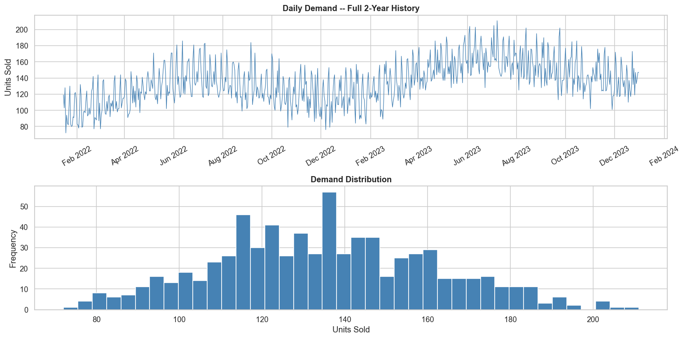
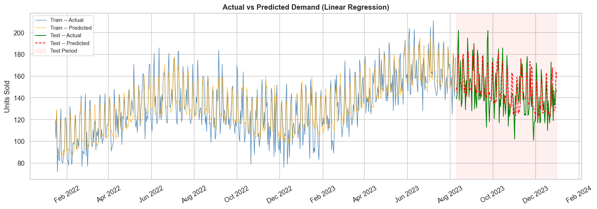
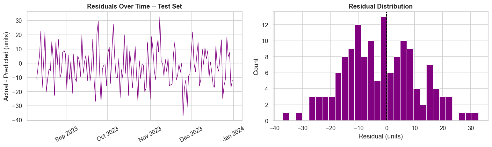
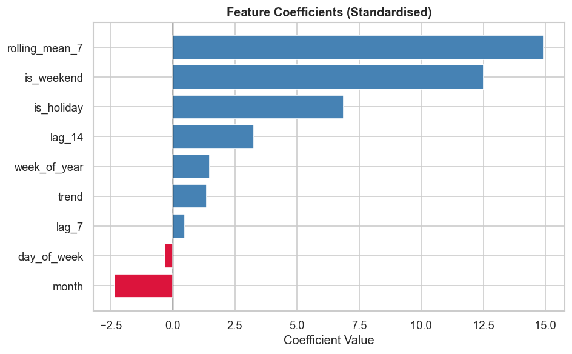

# 📦 Simple Demand Forecast

>Demand forecasting project (linear regression) — built to learn proper time-series handling: lag/rolling features, leakage-free train/test split, residual diagnostics


---

## 🧠 What This Project Is About

This project forecasts **daily product demand** using a **Linear Regression** model.

The goal was to understand the full ML pipeline from scratch:
- How to explore time-series data
- How to build features from dates (lag, rolling average, calendar)
- How to split time-series data properly (no shuffling!)
- How to train, evaluate and visualise a model

I used **synthetic data** (generated by code) so anyone can run this without downloading anything.

---

## 📊 Results

| Metric | Train | Test |
|--------|-------|------|
| MAE    | 9.80  | 10.81 |
| RMSE   | 12.34 | 13.17 |
| R²     | 0.78  | 0.60  |

> RMSE gap is only **0.83** — the model generalises well and is not overfitting.

### Visualisations

**Demand over 2 years + distribution:**


**Actual vs Predicted demand (train in blue/orange, test in green/red):**


**Residuals (errors) — centred around zero, no pattern = good!**


**Which features matter most:**


---

## 🗂️ Project Structure

```
demand_forecast/
│
├── data/
│   └── demand_data.csv         ← Synthetic 2-year daily demand
│
├── src/
│   ├── generate_data.py        ← Generates the dataset (with trend + seasonality)
│   ├── features.py             ← All feature engineering helpers
│   └── train.py                ← Main training + evaluation script
│
├── notebooks/
│   └── demand_forecast.ipynb   ← Step-by-step walkthrough notebook
│
├── plots/                      ← Auto-generated charts
├── requirements.txt
├── .gitignore
└── README.md
```

---

## ⚙️ Features Used

| Feature | What It Captures |
|---------|-----------------|
| `trend` | Long-term growth in demand |
| `day_of_week` | Which day of the week (Mon–Sun) |
| `month` | Month number (seasonal pattern) |
| `week_of_year` | Annual weekly cycle |
| `is_weekend` | Binary flag: 1 if Sat or Sun |
| `lag_7` | Demand from 7 days ago |
| `lag_14` | Demand from 14 days ago |
| `rolling_mean_7` | Average demand over the past 7 days |

---

## 🚀 How to Run

### 1. Clone the repo
```bash
git clone https://github.com/ujjwal77771/demand-forecast.git
cd demand-forecast
```

### 2. Install dependencies
```bash
pip install -r requirements.txt
```

### 3. Generate the synthetic dataset
```bash
python src/generate_data.py
```

### 4. Train the model and generate plots
```bash
python src/train.py
```

### 5. (Optional) Open the Jupyter notebook
```bash
jupyter notebook notebooks/demand_forecast.ipynb
```

---

## 📚 Key ML Concepts I Learned

- **Chronological train/test split**: Never shuffle time-series data — future data must NOT leak into training.
- **Fit scaler on train only**: `StandardScaler.fit()` only on training data, then `.transform()` on both.
- **Lag features**: Using past demand values as predictors (e.g., what was sold 7 days ago).
- **Rolling mean**: A smoothed version of recent demand — reduces noise.
- **Residual analysis**: Errors should be random (no pattern) — if they aren't, the model is missing something.
- **Stationarity (ADF test)**: Checking if the series has a consistent mean/variance over time.
- **R² score**: How much variance in demand the model explains (1.0 = perfect).

---

## 🔮 What I Would Add Next

- [ ] Try more models (Random Forest, XGBoost)
- [ ] Add real holidays as features
- [ ] Forecast multiple products at once
- [ ] Deploy as a simple web app (Flask/Streamlit)

---

## 📝 License

MIT — feel free to use, modify, and learn from this!

---

*Made with ❤️ while learning ML basics — Ujjwal Deep*
